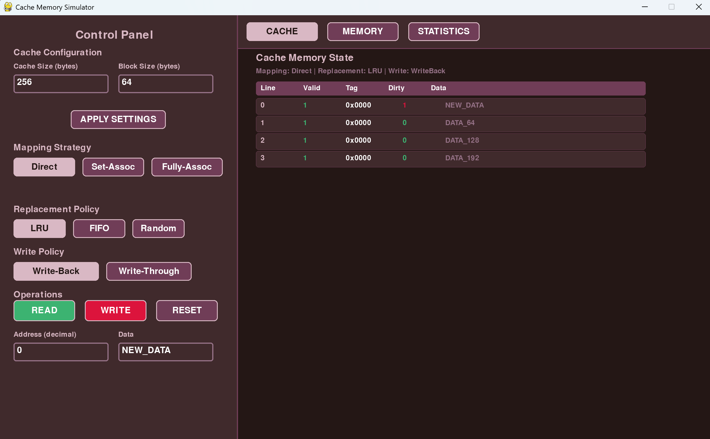

# 🖥️ Cache Memory Simulator

## Project Overview
This project is a **Cache Memory Simulator** implemented in Python. It models the interaction between a CPU cache and main memory while allowing different cache configurations to be tested and analyzed. 
The simulator supports multiple **mapping strategies**, **replacement algorithms**, and **write policies**, and provides an interactive graphical user interface (GUI).

The project is designed with a **modular architecture** (MVC), where each component of the cache system is implemented independently and can be tested in isolation.

---

## Features
- Direct Mapped, Set-Associative, and Fully Associative cache mapping
- Replacement policies:
  - Least Recently Used (LRU)
  - First-In First-Out (FIFO)
  - Random
- Write policies:
  - Write-Through
  - Write-Back
- Cache hit and miss tracking
- Cache hit ratio calculation
- Interactive GUI for visualization and testing
- Component-level unit testing

---

## Project Structure
- **CacheLine** – Represents a single cache line with valid bit, tag, data, and dirty bit
- **CacheMemory** – Manages a collection of cache lines
- **MainMemory** – Simulates main memory storage and access
- **MappingStrategy** – Abstract base class for cache mapping
  - DirectMapping
  - SetAssociative
  - FullyAssociative
- **ReplacementAlgorithm** – Abstract base class for replacement policies
  - LRUAlgorithm
  - FIFOAlgorithm
  - RandomAlgorithm
- **WritePolicy** – Abstract base class for write behavior
  - WriteThrough
  - WriteBack
- **CacheController** – Core controller that coordinates cache operations
- **Statistics** – Tracks cache hits, misses, and hit ratio
- **CacheSimulatorGUI** – Graphical user interface built using Pygame

---

## Cache Mapping Strategies
### Direct Mapping
Each memory block maps to exactly one cache line based on the block index.

### Set-Associative Mapping
Cache lines are divided into sets, and each block maps to a specific set but may occupy any line within that set.

### Fully Associative Mapping
A memory block can be placed in any cache line.

---

## Replacement Algorithms
When a cache miss occurs and all candidate lines are full, one of the following replacement policies is applied:

- **LRU (Least Recently Used):** Replaces the cache line that has not been accessed for the longest time.
- **FIFO (First-In First-Out):** Replaces the oldest cache line.
- **Random:** Randomly selects a cache line for replacement.

---

## Write Policies
- **Write-Through:** Writes data to both the cache and main memory on every write operation.
- **Write-Back:** Writes data only to the cache on a write hit and updates main memory when the cache line is evicted.

---

## Cache Controller
The `CacheController` is responsible for:
- Handling read and write requests
- Detecting cache hits and misses
- Selecting cache lines using mapping strategies
- Replacing cache lines using replacement algorithms
- Applying write policies
- Updating cache statistics

---

## Graphical User Interface (GUI)
The GUI allows users to:
- Configure cache size, block size, and associativity
- Select mapping strategy, replacement policy, and write policy
- Perform read and write operations
- View cache contents
- View main memory contents
- View cache performance statistics

---

## Testing
All major components of the simulator were **individually tested using pytest** to ensure correctness before full integration.

---

## 📷 GUI Preview 

